# Giá Trị Thực - Real Estate Platform Technical Documentation

## 1. System Overview

**Giá Trị Thực** is a Vietnamese real estate platform built with Next.js 15, designed to provide transparent, accurate, and successful property transactions. The application features automatic property valuation, legal support, and AI-powered assistance for real estate transactions.

### 1.1 Core Mission
- **Minh Bạch (Transparent)**: Clear pricing and legal processes
- **Chuẩn Xác (Accurate)**: Precise property valuations and information
- **Thành Công (Successful)**: Streamlined transaction processes

## 2. Technical Architecture

### 2.1 Technology Stack

| Component | Technology | Version |
|-----------|------------|---------|
| **Framework** | Next.js | 15.3.2 |
| **Runtime** | React | 19.0.0 |
| **Language** | TypeScript | ^5 |
| **Styling** | Tailwind CSS | ^3.3.0 |
| **HTTP Client** | Axios | ^1.9.0 |
| **Forms** | React Hook Form | ^7.56.4 |
| **Validation** | Zod | ^3.25.7 |
| **Animation** | Framer Motion | ^12.12.1 |
| **Icons** | React Icons + Hero Icons | ^5.5.0 + ^2.2.0 |
| **Scroll Animation** | AOS (Animate On Scroll) | ^2.3.4 |

### 2.2 Project Structure

```
real_estate/
├── app/                          # Next.js App Router
│   ├── layout.tsx               # Root layout with fonts and metadata
│   ├── page.tsx                 # Home page with component composition
│   ├── globals.css              # Global styles and animations
│   ├── types.d.ts              # Global type declarations
│   ├── favicon.ico             # Application favicon
│   └── properties/[id]/        # Dynamic property detail pages
│       └── page.tsx            # Individual property view
├── components/                   # Reusable UI components
│   ├── Header.tsx              # Navigation header with mobile menu
│   ├── Hero.tsx                # Hero section with search form
│   ├── Properties.tsx          # Property listing with tabs
│   ├── PropertyCard.tsx        # Individual property card
│   ├── PropertyFilter.tsx      # Property filtering controls
│   ├── AiChat.tsx              # AI assistant feature
│   ├── Pricing.tsx             # Pricing/valuation section
│   ├── Testimonials.tsx        # Customer testimonials
│   ├── Process.tsx             # Transaction process steps
│   ├── DreamBanner.tsx         # Marketing banner
│   ├── BankPartners.tsx        # Banking partnership section
│   ├── AppDownload.tsx         # Mobile app promotion
│   ├── Cta.tsx                 # Call-to-action section
│   └── Footer.tsx              # Site footer
├── services/                     # API and business logic
│   └── api.ts                  # Property API integration
├── public/                       # Static assets
├── src/                         # Alternative source structure
└── config files                # Configuration files
```

### 2.3 Application Architecture

```mermaid
graph TB
    A[Client Browser] --> B[Next.js Frontend]
    B --> C[Component Layer]
    C --> D[Service Layer]
    D --> E[External API]
    
    C --> C1[Header/Navigation]
    C --> C2[Hero/Search]
    C --> C3[Property Listings]
    C --> C4[AI Chat Interface]
    C --> C5[Pricing/Valuation]
    
    D --> D1[Property API]
    D --> D2[Search Service]
    D --> D3[Valuation Service]
    
    E --> E1[Property Database]
    E --> E2[Image Storage]
    E --> E3[AI Services]
```



## 3. Core Components and Functionalities

### 3.1 Layout Structure ([`app/layout.tsx`](app/layout.tsx:17))

```typescript
export const metadata: Metadata = {
  title: "Giá Trị Thực - Nền tảng bất động sản minh bạch",
  description: "Nền tảng kết nối bất động sản trực tuyến, định giá tự động, hỗ trợ pháp lý minh bạch. Giao dịch trực tiếp, không lo kê giá.",
};
```

**Features:**
- Vietnamese language support (`lang="vi"`)
- Custom font integration (Montserrat, Open Sans)
- External CSS libraries (Font Awesome, AOS)
- Responsive viewport configuration

### 3.2 Navigation System ([`components/Header.tsx`](components/Header.tsx:5))

**Key Features:**
- Responsive mobile menu with smooth animations
- Scroll-based header styling changes
- Vietnamese navigation labels
- Gradient logo with hover effects
- Authentication placeholder links

**Navigation Structure:**
- Trang Chủ (Home)
- Tìm Kiếm (Search)
- Ước Mơ (Dreams)
- Bất Động Sản (Properties)
- Định Giá (Pricing)
- Đánh Giá (Testimonials)

### 3.3 Search Functionality ([`components/Hero.tsx`](components/Hero.tsx:19))

**Search Form Components:**
```typescript
// Property type options
<option value="can-ho">Căn hộ</option>      // Apartment
<option value="nha-rieng">Nhà riêng</option> // House
<option value="dat-nen">Đất nền</option>     // Land
<option value="biet-thu">Biệt thự</option>   // Villa
```

**Location Options:**
- TP. HCM (Ho Chi Minh City)
- Hà Nội (Hanoi)
- Đà Nẵng (Da Nang)
- Khác (Others)

### 3.4 Property Management System

#### 3.4.1 Property Data Model ([`services/api.ts`](services/api.ts:3))

```typescript
export interface Property {
  id: number;
  title: string;
  description: string;
  price: number;
  type: string;
  area: number;
  bedrooms: number;
  bathrooms: number;
  address: string;
  latitude: number;
  longitude: number;
  features: string[];
  images: string[];
  status: string;
  owner_id: number;
  created_at: string;
  updated_at: string;
}
```

#### 3.4.2 Property Filtering ([`services/api.ts`](services/api.ts:35))

```typescript
export interface PropertyFilters {
  type?: string;
  min_price?: string;
  max_price?: string;
  bedrooms?: string;
  status?: string;
  page?: number;
  per_page?: number;
}
```

#### 3.4.3 API Integration ([`services/api.ts`](services/api.ts:45))

**Endpoints:**
- `GET /api/properties` - Paginated property listing
- `GET /api/properties/{id}` - Individual property details

**Error Handling:**
- Network error management
- 404 handling for missing properties
- Generic error fallbacks

### 3.5 Property Display System ([`components/Properties.tsx`](components/Properties.tsx:6))

**Tab-based Filtering:**
- Tất cả (All properties)
- Căn hộ (Apartments)
- Nhà riêng (Houses)
- Đất nền (Land)
- Biệt thự (Villas)

**Property Card Features:**
- Image display with Unsplash integration
- Price formatting in Vietnamese đồng
- Location with map markers
- Property specifications (bedrooms, bathrooms, area)
- Status badges (Mới nhất, Giá tốt, Giao dịch nhanh)

### 3.6 AI Assistant Integration ([`components/AiChat.tsx`](components/AiChat.tsx:1))

**AI Services:**
- **Hỗ trợ pháp lý**: Legal support and documentation guidance
- **Định giá bất động sản**: Property valuation based on market data
- **Tư vấn đàm phán**: Negotiation strategies and contract terms

## 4. Data Flow and State Management

### 4.1 Property Data Flow


### 4.2 Property Detail Flow


## 5. Styling and Design System

### 5.1 Color Palette ([`tailwind.config.js`](tailwind.config.js:26))

```javascript
colors: {
  primary: '#1A376A',     // Dark blue
  secondary: '#E8F0FE',   // Light blue
  accent: '#FF7A00',      // Orange
  darkAccent: '#E56D00',  // Dark orange
  darkBlue: '#0F2A5A',    // Darker blue
  lightOrange: '#FFEBD6', // Light orange
}
```

### 5.2 Typography System ([`tailwind.config.js`](tailwind.config.js:34))

```javascript
fontFamily: {
  heading: ['Montserrat', 'sans-serif'],
  body: ['Open Sans', 'sans-serif'],
}
```

### 5.3 Animation System ([`app/globals.css`](app/globals.css:65))

**Custom Animations:**
- **Float**: Gentle vertical movement for decorative elements
- **Gradient**: Background color transitions
- **Bubble Float**: Complex floating animations for dream banner
- **Wave Move**: Continuous wave motion effects
- **Fade In**: Smooth element entrance animations

**Animation Usage:**
```css
/* Floating elements */
.animate-float { animation: float 6s ease-in-out infinite; }

/* Gradient backgrounds */
.gradient-bg { animation: gradient 15s ease infinite; }

/* Interactive hover effects */
.hover:scale-105 { transform: scale(1.05); }
```

## 6. API Endpoints and Integration

### 6.1 Base Configuration ([`services/api.ts`](services/api.ts:1))

```typescript
const API_URL = process.env.NEXT_PUBLIC_API_URL || 'http://localhost:8000/api';
```

### 6.2 Property Endpoints

#### GET /api/properties
**Purpose**: Retrieve paginated property listings with optional filters

**Query Parameters:**
- `type`: Property type filter
- `min_price`, `max_price`: Price range filters
- `bedrooms`: Bedroom count filter
- `status`: Property status filter
- `page`, `per_page`: Pagination controls

**Response Format:**
```typescript
{
  data: Property[],
  meta: {
    current_page: number,
    from: number,
    last_page: number,
    per_page: number,
    to: number,
    total: number
  }
}
```

#### GET /api/properties/{id}
**Purpose**: Retrieve detailed information for a specific property

**Response Format:**
```typescript
{
  data: Property
}
```

**Error Handling:**
- 404: Property not found
- 500: Server error
- Network errors: Connection issues

## 7. Image and Asset Management

### 7.1 External Image Integration ([`next.config.js`](next.config.js:3))

```javascript
images: {
  remotePatterns: [
    {
      protocol: 'https',
      hostname: 'images.unsplash.com',
    },
  ],
}
```

### 7.2 Image Optimization

**Next.js Image Component Usage:**
- Automatic WebP conversion
- Lazy loading implementation
- Responsive image sizing
- SEO-friendly alt attributes

### 7.3 Icon Integration

**Font Awesome Icons:**
- CDN-based loading for performance
- Comprehensive icon set for real estate
- Consistent sizing and styling

**Hero Icons:**
- React component integration
- TypeScript support
- Customizable styling

## 8. Performance Optimizations

### 8.1 Code Splitting and Loading

**Next.js App Router Benefits:**
- Automatic code splitting by route
- Server-side rendering for initial load
- Client-side navigation for subsequent pages

**Dynamic Imports:**
```typescript
// AOS library lazy loading
useEffect(() => {
  if (typeof window !== 'undefined') {
    const AOS = require('aos');
    AOS.init({
      duration: 800,
      easing: 'ease-in-out',
      once: true
    });
  }
}, []);
```

### 8.2 Animation Performance ([`app/page.tsx`](app/page.tsx:37))

**AOS Configuration:**
- `once: true` - Animations trigger only once
- Optimized duration settings
- CSS-based animations for smooth performance

### 8.3 Bundle Optimization

**Production Build Flags:**
```json
"build": "next build --no-lint"
```

**Turbopack Development:**
```json
"dev": "next dev --turbopack"
```

## 9. Security Considerations

### 9.1 Environment Variables

**API Configuration:**
- `NEXT_PUBLIC_API_URL`: Public API endpoint
- Environment-based configuration
- Fallback to localhost for development

### 9.2 Input Validation

**Search Form Security:**
- Client-side input sanitization
- Server-side validation expected
- XSS prevention through React's built-in protections

### 9.3 Image Security

**Remote Image Validation:**
- Whitelist approach for image domains
- Unsplash.com specifically allowed
- Next.js automatic image optimization

## 10. Error Handling and User Experience

### 10.1 Property Detail Error Handling ([`app/properties/[id]/page.tsx`](app/properties/[id]/page.tsx:45))

**Loading States:**
```typescript
if (loading) {
  return (
    <div className="flex justify-center items-center h-screen">
      <div className="animate-spin rounded-full h-12 w-12 border-t-2 border-b-2 border-blue-500"></div>
    </div>
  );
}
```

**Error States:**
```typescript
if (error) {
  return (
    <div className="bg-red-100 border border-red-400 text-red-700 px-4 py-3 rounded">
      <h2 className="text-xl font-bold mb-2">Error</h2>
      <p>{error}</p>
      <button onClick={() => router.push('/')}>Back to Home</button>
    </div>
  );
}
```

### 10.2 Progressive Enhancement

**Graceful Degradation:**
- CSS animations with fallbacks
- JavaScript-enhanced interactions
- Base functionality without JavaScript

## 11. Accessibility Features

### 11.1 Semantic HTML Structure

**Navigation Accessibility:**
```typescript
<button
  onClick={() => setIsOpen(!isOpen)}
  aria-label={isOpen ? "Đóng menu" : "Mở menu"}
  aria-expanded={isOpen}
>
```

**Tab Navigation:**
```typescript
<button 
  role="tab" 
  aria-controls="all-tab" 
  aria-selected={activeTab === 'all'}
>
```

### 11.2 Screen Reader Support

- Proper heading hierarchy (h1, h2, h3)
- Alt text for images
- ARIA labels for interactive elements
- Focus management for mobile menu

## 12. Deployment and Configuration

### 12.1 Build Configuration

**Package.json Scripts:**
```json
{
  "dev": "next dev --turbopack",
  "build": "next build --no-lint",
  "start": "next start",
  "lint": "next lint"
}
```

### 12.2 Environment Setup

**Development Requirements:**
- Node.js (compatible with Next.js 15)
- npm/yarn/pnpm package manager
- Git for version control

**Production Deployment:**
- Vercel (recommended)
- Netlify
- Custom server deployment

### 12.3 Configuration Files

**TypeScript Configuration ([`tsconfig.json`](tsconfig.json)):**
- Strict type checking enabled
- Path mapping for clean imports
- Next.js optimized settings

**ESLint Configuration ([`.eslintrc.json`](.eslintrc.json)):**
- Next.js recommended rules
- TypeScript integration
- Custom rule overrides

## 13. Integration Points and APIs

### 13.1 Backend API Integration

**Expected Backend Structure:**
```
Laravel/PHP Backend (inferred)
├── /api/properties (GET, POST)
├── /api/properties/{id} (GET, PUT, DELETE)
├── /api/users (User management)
├── /api/auth (Authentication)
└── /api/valuations (Property valuation)
```

### 13.2 Third-party Integrations

**Current Integrations:**
- Unsplash for property images
- Google Fonts for typography
- Font Awesome for icons
- AOS for scroll animations

**Potential Future Integrations:**
- Google Maps for property locations
- Payment gateways for transactions
- AI/ML services for property valuation
- Banking APIs for mortgage integration

## 14. Development Workflow

### 14.1 Getting Started

```bash
# Clone repository
git clone [repository-url]

# Install dependencies
npm install

# Start development server
npm run dev

# Build for production
npm run build

# Start production server
npm start
```

### 14.2 Development Guidelines

**Component Structure:**
- Functional components with hooks
- TypeScript for type safety
- Tailwind for styling
- Props interface definitions

**File Naming Conventions:**
- PascalCase for components (`PropertyCard.tsx`)
- camelCase for utilities (`api.ts`)
- kebab-case for assets (`favicon.ico`)

## 15. Future Enhancements and Roadmap

### 15.1 Planned Features

**Short-term:**
- Real property data integration
- User authentication system
- Property favorites functionality
- Advanced search filters
- Map-based property search

**Long-term:**
- AI-powered property recommendations
- Virtual property tours
- Mortgage calculator integration
- Real-time chat system
- Mobile application
- Property valuation API
- Legal document automation

### 15.2 Technical Improvements

**Performance:**
- Database query optimization
- CDN implementation for images
- Service worker for offline functionality
- Progressive Web App (PWA) features

**User Experience:**
- Advanced filtering options
- Property comparison tools
- Saved searches
- Email notifications
- Social sharing features

## 16. Maintenance and Monitoring

### 16.1 Code Quality

**ESLint Rules:**
- Consistent code formatting
- TypeScript strict mode
- Next.js best practices
- Custom rule configurations

**Type Safety:**
- Comprehensive TypeScript coverage
- Interface definitions for all data
- Generic type parameters
- Runtime type validation

### 16.2 Performance Monitoring

**Metrics to Track:**
- Page load times
- API response times
- Image optimization efficiency
- Bundle size optimization
- Core Web Vitals compliance

## 17. Conclusion

The Giá Trị Thực real estate platform represents a modern, scalable solution for Vietnamese property transactions. Built with Next.js 15 and TypeScript, it provides a solid foundation for real estate operations with emphasis on transparency, accuracy, and user success.

The modular architecture allows for easy feature expansion, while the responsive design ensures accessibility across all devices. The comprehensive styling system and animation framework create an engaging user experience that aligns with modern web standards.

The platform is designed to integrate seamlessly with backend APIs and third-party services, making it suitable for production deployment with proper backend infrastructure and database systems.

---

**Documentation Version**: 1.0  
**Last Updated**: January 10, 2025  
**Framework Version**: Next.js 15.3.2  
**TypeScript Version**: ^5.0.0